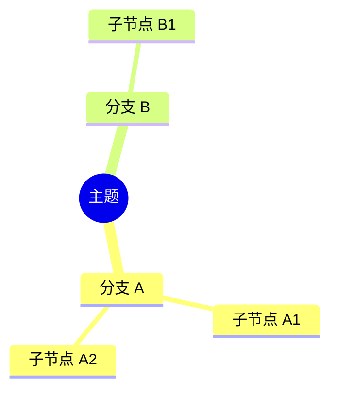
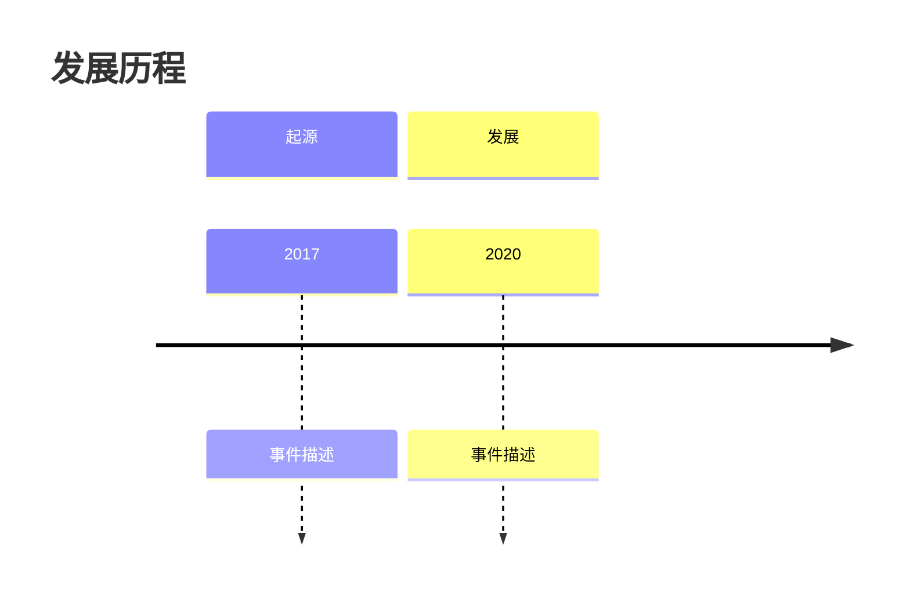
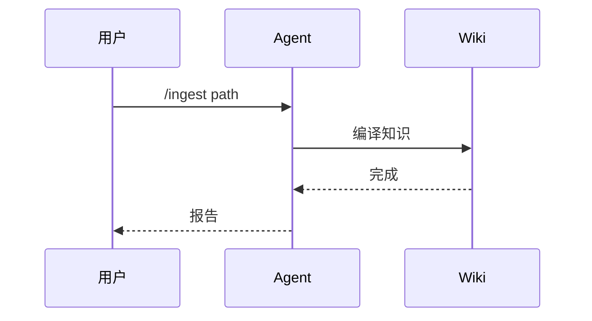
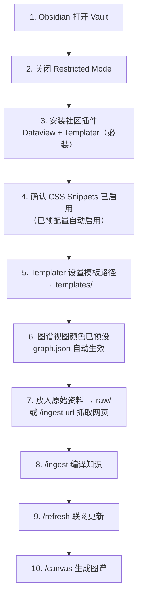

# Obsidian 配置说明

本知识库已预置统一的 Obsidian 配置和 CSS 样式，开箱即用。

## 预配置项

以下配置已通过 `.obsidian/` 目录中的 JSON 文件预设，打开 Vault 后自动生效：

| 配置文件 | 预设内容 |
|---------|---------|
| `app.json` | 默认阅读模式（`defaultViewMode: reading`）、新文件存入 `wiki/`、附件存入 `assets/`、最短路径链接格式 |
| `appearance.json` | 主题色 `#A34A52`（胭脂）、`cssTheme: Minimal`、自动启用 10 个编辑风 CSS 片段 |
| `templates.json` | 核心 Templates 插件模板文件夹 → `templates/` |
| `graph.json` | 图谱视图按目录着色：概念(蓝)、实体(绿)、来源(橙)、综合(紫)、MOC(黄) |
| `core-plugins.json` | 启用 Graph、Backlink、Page Preview、Templates、Outline、Tag Pane 等 |
| `community-plugins.json` | 预置 12 个推荐社区插件的 ID（需手动安装） |

> 如需修改任何预配置，直接编辑 `.obsidian/` 下对应的 JSON 文件即可。

## 已启用的核心插件

| 插件 | 用途 |
|------|------|
| Graph | 知识图谱可视化 |
| Backlink | 反链面板 |
| Page Preview | 悬浮预览 |
| Templates | 笔记模板 |
| Note Composer | 笔记合并/拆分 |
| Outline | 文档大纲 |
| Tag Pane | 标签面板 |
| Word Count | 字数统计 |

## 推荐安装的社区插件

首次打开 Vault 后，请前往 **Settings → Community plugins → Browse** 安装以下插件。

### 核心必装（知识库功能依赖）

| 插件 | 用途 |
|------|------|
| **Dataview** | 数据查询与动态列表（index.md 仪表盘依赖此插件） |
| **Templater** | 高级模板引擎（4 个标准模板依赖此插件） |
| **Omnisearch** | 全文搜索增强（query skill 的备选检索路径） |

### 推荐选装（提升使用体验）

| 类别 | 插件 | 用途 |
|------|------|------|
| 效率 | **QuickAdd** | 快速捕获与笔记创建 |
| 效率 | **Commander** | 自定义命令与工具栏 |
| 组织 | **Calendar** | 日历视图 |
| 组织 | **Periodic Notes** | 周期笔记（日/周/月/年） |
| 组织 | **Tag Wrangler** | 标签批量管理 |
| 视觉 | **Style Settings** | 主题样式微调 |
| 视觉 | **Callout Manager** | Callout 自定义管理 |
| 视觉 | **Hover Editor** | 悬浮编辑窗口 |
| 视觉 | **Mindmap** | 将 Markdown 层级标题渲染为可交互思维导图 |
| 导航 | **Recent Files** | 最近打开文件 |
| 获取 | **Web Clipper** | 浏览器扩展，将网页文章转为 Markdown 存入 raw/ |

> 已安装的插件列表保存在 `.obsidian/community-plugins.json` 中。

## CSS 样式片段

位于 `.obsidian/snippets/`，按加载顺序编号，已全部启用。整体风格为中文出版物的**编辑风**：标题走衬线（Charter / 宋体）承担版面职责，正文走黑体保证屏幕可读性；表格只留横线（三线表），引用去底色只留竖线；界面用发丝线分区，用一道 2px 强调色短线标记当前位置。

| 片段 | 说明 |
|------|------|
| `01-foundation.css` | 设计基石：宣纸 / 夜墨双主题配色、字体栈、圆角、栏宽行高 token |
| `02-typography.css` | 阅读排版：标题层级（H1 短胭脂线 / H2 上方发丝线 / H3 起转黑体）、三线表、引用、图片题注、分隔线 |
| `03-callouts.css` | Callout 语汇：发丝描边 + 2px 语义色竖线；含多栏、画廊、浮动批注、页边注、信息框 |
| `04-components.css` | 双链、外部链接、标签、代码块（含语言标签）、属性区、嵌入内容 |
| `05-layout.css` | 版式模式：`wide-page` / `columns-2` / `cards` / `article` / `drop-cap` / `sticky-heading` 等 |
| `06-chrome.css` | 界面外壳：侧边栏、标签页、状态栏、悬浮预览、命令面板、图谱、打印 |
| `07-diagrams.css` | 图表调色：把 Mermaid / Markmap / Canvas 的 token 接到编辑风色板 |
| `08-mermaid.css` | Mermaid 全图表类型样式 |
| `09-markmap.css` | Markmap 思维导图 |
| `10-canvas.css` | Canvas 白板 |

> `08` / `09` / `10` 内部沿用 `--wiki-*` token 命名，由 `07-diagrams.css` 统一重新赋值到编辑风色板。这三个文件与通用 token 解耦，可以独立升级。

### 图表配色约定（重要）

Mermaid 源码里**只写语义 class，不写色值**：


可用 class：`blue` `cyan` `green` `yellow` `orange` `red` `purple`，以及实心强调用的 `solid`。

- **不要写 `classDef xxx fill:var(--x)` 或 `fill:rgba(...)`** —— Mermaid 的 classDef 只接受简单色值，写变量或 rgba 会直接抛解析错误，导致整张图渲染失败。
- **也不要写 `style 节点 fill:#hex`** —— 那样绕过了主题变量，暗色模式下必然失配。

> **完整样式指南见 [`STYLE-GUIDE.md`](STYLE-GUIDE.md)** —— 那一页本身就是样例，在 Obsidian 中打开即可看到所有效果与写法。

### 调整与回退

- **改配色 / 换字体**：只改 `01-foundation.css` 顶部的 token 变量，其余九个文件全部跟着走。
- **开关单个片段**：**Settings → Appearance → CSS Snippets**。
- **切换风格**：`.obsidian/snippets-legacy/` 里另存了一套 Nord 冷色版（`wiki-reading` / `wiki-callouts` / `wiki-components`，扩展名为 `.css.disabled`）。想换回去，先把 `01`–`06` 停用或移出 `snippets/`，再去掉这三个文件的 `.disabled` 后缀并移回 `snippets/` 目录。

## 标准模板

位于项目根目录 `templates/`，包含 4 种页面类型：

| 模板 | 用途 | 关键区块 |
|------|------|---------|
| `entity.md` | 人物、公司、工具、产品等实体 | 基本资料、时间线、评价与影响 |
| `concept.md` | 概念、框架、方法论 | 定义、原理、类比、误区、应用场景 |
| `source.md` | 原始资料摘要 | 元信息、核心摘要、批注、可信度评估 |
| `synthesis.md` | 综合分析报告 | 研究问题、证据表、结论、行动建议 |

### 配置 Templater 使用模板

1. 安装 **Templater** 社区插件
2. 前往 **Settings → Templater**，设置 `Template folder location` 为 `templates`
3. 可选：设置 `Trigger Templater on new file creation` 为开启

### 手动使用模板

新建笔记时，按 `Ctrl/Cmd + P` 打开命令面板，搜索 "Templater: Open Insert Template Modal" 选择对应模板。

## Dataview 动态仪表盘

`wiki/index.md` 已预置 Dataview 查询，安装 Dataview 插件后自动生效：

- **最新来源**：自动列出最近摄入的 raw 资料
- **概念库/实体库/综合分析**：按类型动态聚合
- **待处理清单**：自动找出草稿状态、无来源的页面

如需创建新的主题地图（MOC），参考 `wiki/mocs/README.md` 中的 Dataview 查询模板。

## 思维导图 (Mindmap)

本知识库预置了 `wiki/mocs/Mindmap-知识库全景.md`，安装 **Obsidian Mindmap** 插件后可直接渲染为可交互的思维导图。

### 使用方法

1. 安装 **Mindmap** 社区插件（见上方推荐插件表）
2. 打开 `wiki/mocs/Mindmap-知识库全景.md`
3. 点击右上角的 Mindmap 图标，切换到思维导图视图
4. 点击节点可折叠/展开，滚轮缩放，拖拽平移

### 创建自定义思维导图

任何使用层级标题（`#`、`##`、`###`...）的 Markdown 文件都可以用 Mindmap 插件渲染。例如：

```markdown
# 主题

## 分支 A
### 子分支 A1
### 子分支 A2

## 分支 B
### 子分支 B1
```

适合用于：知识体系梳理、项目规划、学习路径设计。

## 推荐主题

编辑风样式以 **Minimal** 为底座（`appearance.json` 中 `cssTheme` 已预设为 `Minimal`）—— 栏宽、卡片、Style Settings 接口都由 Minimal 提供，样式片段在此之上做编辑风改造。

- **Minimal**（推荐 / 默认）— 极简高定制，编辑风的基础
- 其他主题也可用，但栏宽、圆角、卡片等部分会回落到该主题的默认表现

## Obsidian Markdown 高级语法

本知识库的 Agent 在创建内容时遵循统一的 Markdown 规范，支持以下 Obsidian 特有语法：

### 内部链接（Wikilinks）

```markdown
[[页面名称]]                    → 基础双链
[[页面名称|显示文本]]           → 自定义显示文本
[[页面名称#标题]]               → 链接到特定标题
[[页面名称#^块ID]]              → 链接到特定段落
```

**块 ID**：在任意段落末尾追加 `^块ID` 即可创建精确链接锚点：
```markdown
这是一个可被精确引用的段落。 ^my-block-id
```

### 嵌入（Embeds）

```markdown
![[图片.png|300]]              → 嵌入图片并限制宽度
![[文档.pdf#page=3]]           → 嵌入 PDF 第 3 页
![[页面名称#^块ID]]            → 嵌入其他页面的特定段落
```

### Callouts

```markdown
> [!note]
> 笔记型 callout

> [!warning] 自定义标题
> 带自定义标题的警告

> [!faq]- 默认折叠
> 可折叠的 callout（- 折叠，+ 展开）
```

### 注释（Comments）

```markdown
这是可见文本 %%这是隐藏的 AI 批注%%。

%%
整段隐藏内容。
可用于记录处理逻辑，不影响阅读视图。
%%
```

### Mermaid 图表

Obsidian 原生支持 Mermaid 图表，无需安装插件。在代码块中使用 `mermaid` 语言标记即可：

**流程图：**


**思维导图：**


**时间线：**


**时序图：**


> 更多图表类型（甘特图、类图、状态图等）参考 [Mermaid 官方文档](https://mermaid.js.org/)。

---

## Canvas 可视化

本知识库包含 `json-canvas` Agent Skill，可将 `wiki/` 中的知识网络自动生成为 `.canvas` 可视化文件。

### 使用方法

在 Kimi Code CLI 中执行：
```
/canvas
```

Agent 会扫描 `wiki/` 中的页面和双链关系，生成一个可视化画布文件（如 `wiki/knowledge-graph.canvas`），你可以在 Obsidian 的 Canvas 视图中打开查看和编辑。

### Canvas 中的节点类型

- **文本节点** — 概念定义、关键洞察
- **文件节点** — 链接到具体的 wiki 页面（可点击跳转）
- **链接节点** — 外部参考 URL
- **分组节点** — 按主题组织相关概念

---

## 首次使用步骤



1. 在 Obsidian 中打开本文件夹作为 Vault
2. 前往 **Settings → Community plugins**，关闭 Restricted mode
3. 按上表安装需要的社区插件（至少安装 **Dataview** 和 **Templater**）
4. 在 **Appearance → CSS Snippets** 中确认十个片段已启用（已预配置自动启用）
5. Templater 的模板文件夹已在 `templates.json` 中预设为 `templates/`（如使用 Templater 插件，需在 **Settings → Templater** 中手动设置一次）
6. 图谱视图颜色分组已在 `graph.json` 中预设，打开图谱视图即可看到分类着色
7. 将原始资料放入 raw/ 目录，或直接执行 `/ingest <url>` 抓取网页
8. 执行 `/ingest` 开始编译知识
9. 定期执行 `/refresh` 联网更新陈旧内容
10. 执行 `/canvas` 生成知识网络可视化图谱

## 获取原始资料

### URL 直接摄入（最便捷）

在 Kimi Code CLI 中直接执行：
```
/ingest https://example.com/article/xxx
```

Agent 会自动抓取网页内容，转换为 Markdown 存入 `raw/01-articles/`，然后按正常流程编译到 `wiki/`。无需安装任何浏览器扩展。

### Web Clipper（推荐用于批量剪藏）

安装 Obsidian Web Clipper 浏览器扩展后，可以在浏览网页时一键将文章转为 Markdown 保存到 `raw/01-articles/`。

1. 在 Obsidian 设置中确认 Web Clipper 的保存路径指向 `raw/01-articles/`
2. 浏览网页时点击扩展图标，选择"Clip as Markdown"
3. 剪藏后的文件会自动出现在 raw/ 目录中
4. 执行 `/ingest` 编译到 wiki/

### 图片本地化

如果剪藏的文章包含图片，建议将图片下载到本地：
1. 在 **Settings → Files and links** 中设置 Attachment folder path 为 `assets/`
2. 在 **Settings → Hotkeys** 中搜索 "Download" 找到 "Download attachments for current file"
3. 绑定快捷键（如 Ctrl+Shift+D）
4. 剪藏文章后按快捷键，所有图片自动下载到本地

## 联网更新（refresh）

知识库中的内容会随时间推移而过时。使用 `/refresh` 命令可以：

- 扫描 wiki/ 中陈旧的页面（基于 `last_refreshed` 字段）
- 按领域自动设置不同的刷新周期（AI/技术 30 天，商业 45 天，科学 90 天）
- 联网搜索最新信息，与现有内容对比
- 发现新信息时更新页面或标记冲突
- 输出刷新报告，列出所有更新和待确认项

建议每月执行一次 `/refresh` 保持知识库的时效性。
