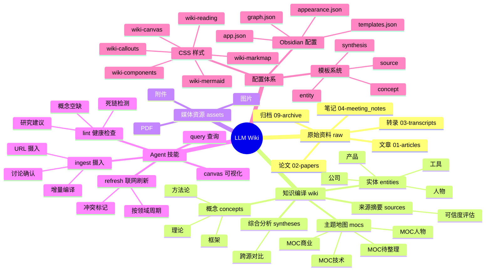
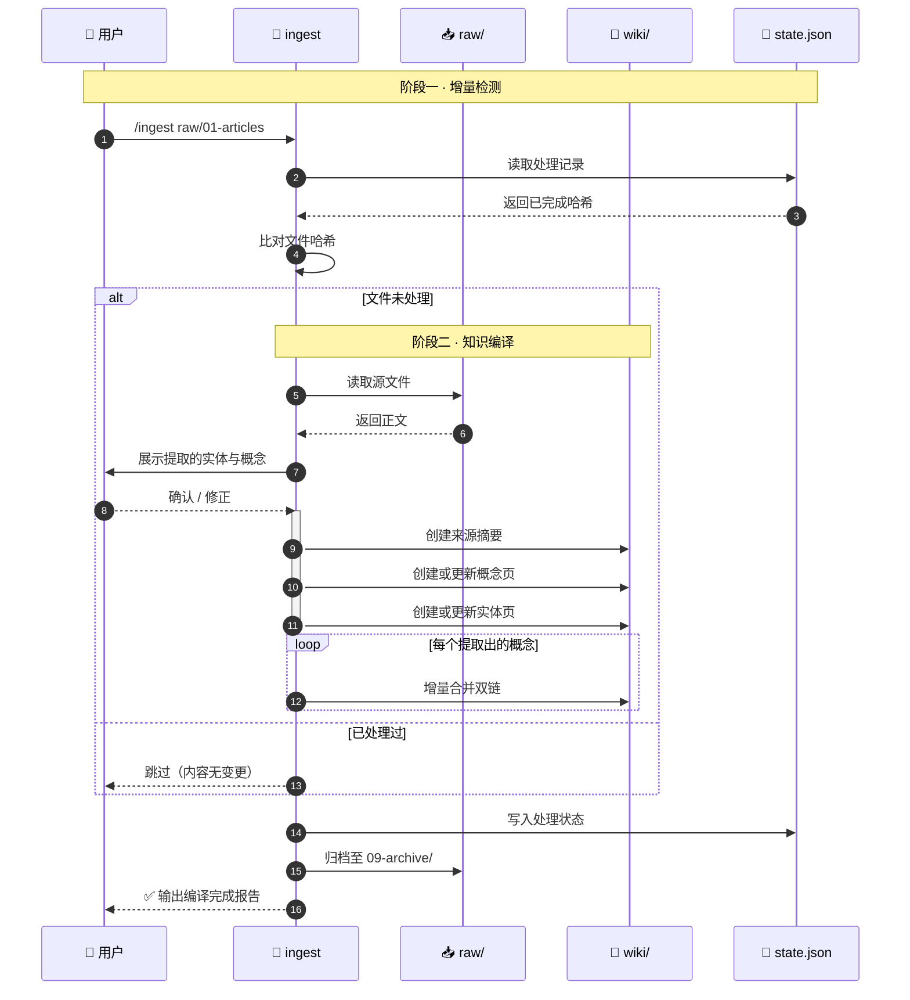
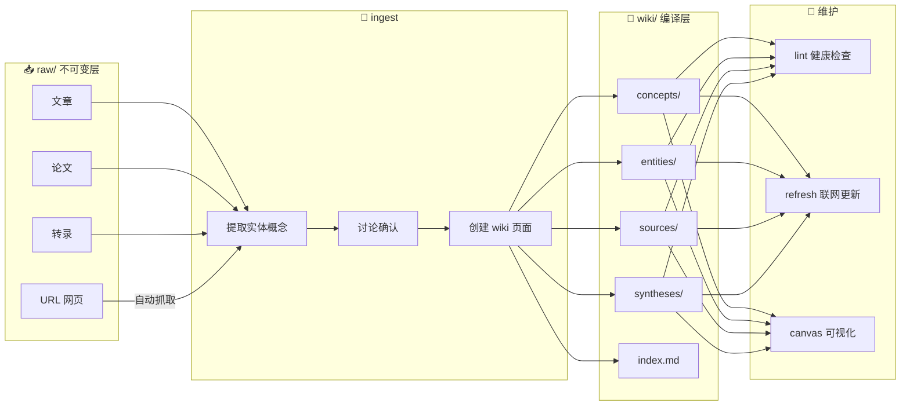
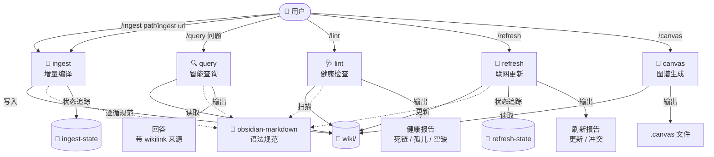

# 知识库全景

> [!tip] 关于本页面
> 本页所有图表使用 **Mermaid** 语法，Obsidian 原生支持，无需安装任何插件。
> 图表配色由 `wiki-mermaid.css` 统一接管：**同一份源码在深色与浅色主题下都能正确显示**，
> 因此这里不使用 `style X fill:#...` 这类硬编码颜色，而是通过语义 `class` 引用配色变量。

## 架构总览



## 知识摄入时序

展示一次 `/ingest` 从增量检测到归档的完整往返过程。



## 知识编译流程



## Agent 技能交互



## 目录权限模型

三层分离架构：不可变层 → 媒体层 → 编译层。

```mermaid
flowchart TB
    subgraph Immutable["⛔ 不可变层"]
        direction LR
        RAW["raw/<br/>原始资料<br/>只读"]
        ARC["raw/09-archive/<br/>归档区<br/>禁止读取"]
    end

    subgraph Media["🖼️ 媒体层"]
        ASSETS["assets/<br/>图片 / PDF / 附件<br/>引用 ![[file]]"]
    end

    subgraph Workspace["✏️ 编译层 Agent 工作区"]
        direction LR
        WIKI["wiki/<br/>概念 / 实体 / 来源 / 综合<br/>可创建 / 更新 / 提炼"]
        TPL["templates/<br/>Templater 模板<br/>只读引用"]
    end

    subgraph Config["⚙️ 配置层"]
        direction LR
        OBS[".obsidian/<br/>Obsidian 配置"]
        CLD[".claude/<br/>Agent Skills + 状态文件"]
    end

    RAW -->|ingest 编译| WIKI
    WIKI -->|![[嵌入]]| ASSETS
    TPL -.->|模板引用| WIKI

    class RAW,ARC red
    class ASSETS orange
    class WIKI green
    class TPL,CLD blue
    class OBS purple

```

## 关联连接

- [[index]] — 全局内容字典
- [[log]] — 操作日志
- [[MOC-技术]] — 技术领域主题地图
- [[MOC-商业]] — 商业领域主题地图
- [[MOC-人物]] — 人物与机构主题地图
- [[MOC-待整理]] — 待分类与草稿
